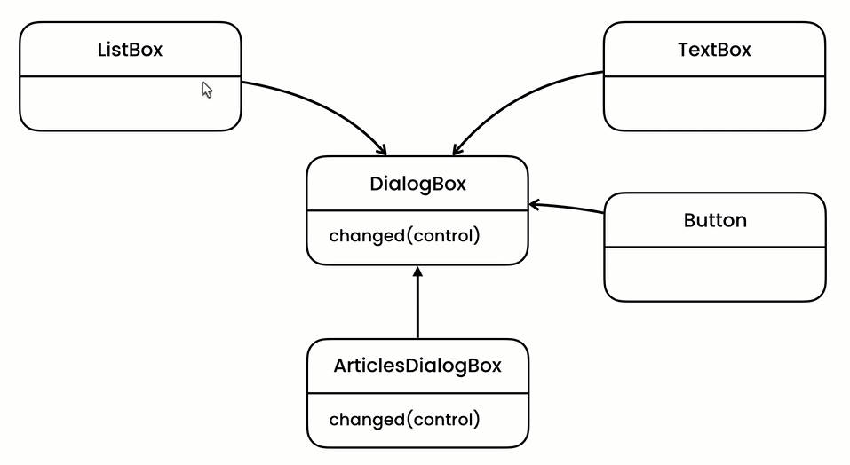

The mediator pattern is called mediator because an object sits in the middle and lets other objects talk to each other.

This is the example:  

 

Here, we have a single place to define all the logic. That single place is the `changed(control)` method inside the `DialogBox` interface.

The `DialogBox` is mediating the interactions of `ListBox`, `TextBox`, `Button` objects.

We can also implement the mediator pattern using the observer pattern.
