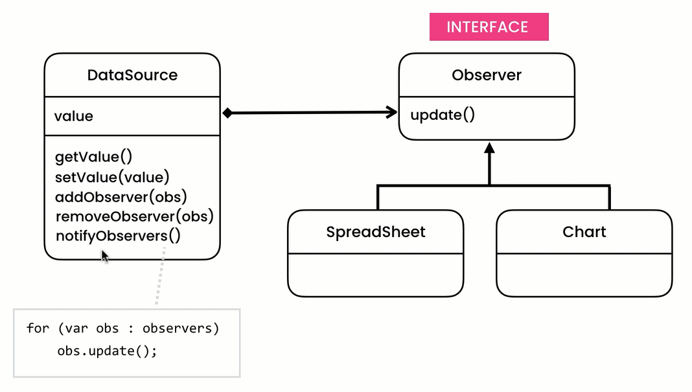

We use the observer pattern in situations where the state of an object changes and we need to notify other objects about these changes.

Understanding the observer pattern was easy for me. 
I create an object and when I change the state of that object, other objects that inherited the `Observer` interface get notified about the changes.  
In the runtime, we can add, remove and notify observers.

This is an example of how observer pattern works:  

The structure of the observer pattern in GOF book: 

Passing the value: