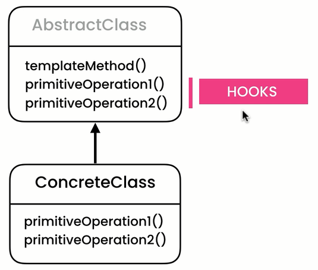

I like this pattern.  
The logic behind it is interesting.

We use inheritance to implement template method pattern.

 

We move the common behavior (`execute()`) inside the `Task` abstract class. This way, we are reusing code.  
Then inside each type of task (`TransferMoney` or `GenerateReport`) we implement the `doExecute()` method to specify what should happen.  
`doExecute()` inside TransferMoney -> has the logic for transfering money. 
`doExecute()` inside GenerateReport -> has the logic for generating a report.

Note 1: We call it the template method pattern, because our `execute` method defines a template or a skeleton for an operation.

The structure represented in the GOF book: 
  

Note 2: We don't necessarily need to make `primitiveOperation1()` and `primitiveOperation2()` methods abstract. We can give them a default implementation and leave it up to the sub-classes to determine if they want to override those methods or not. 

In that case, we refer to those methods as hooks. 
Those are hook operations. 
It is a common technique in a lot of frameworks out there. 
  
